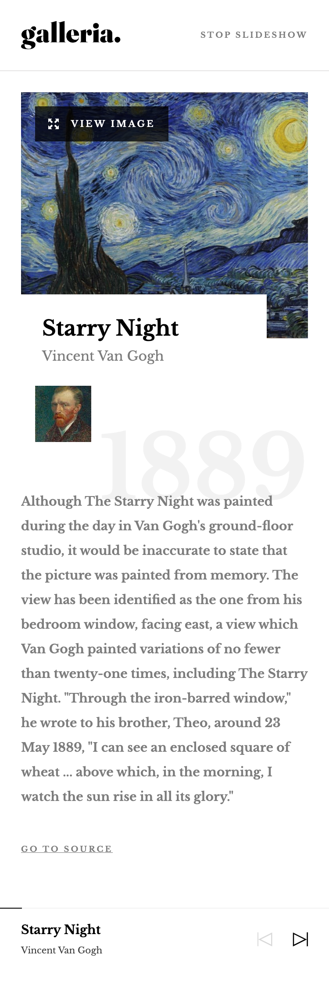
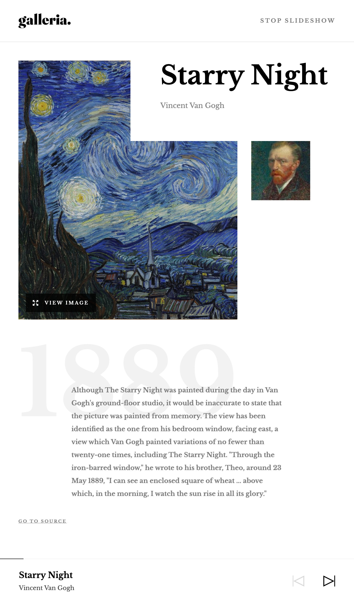
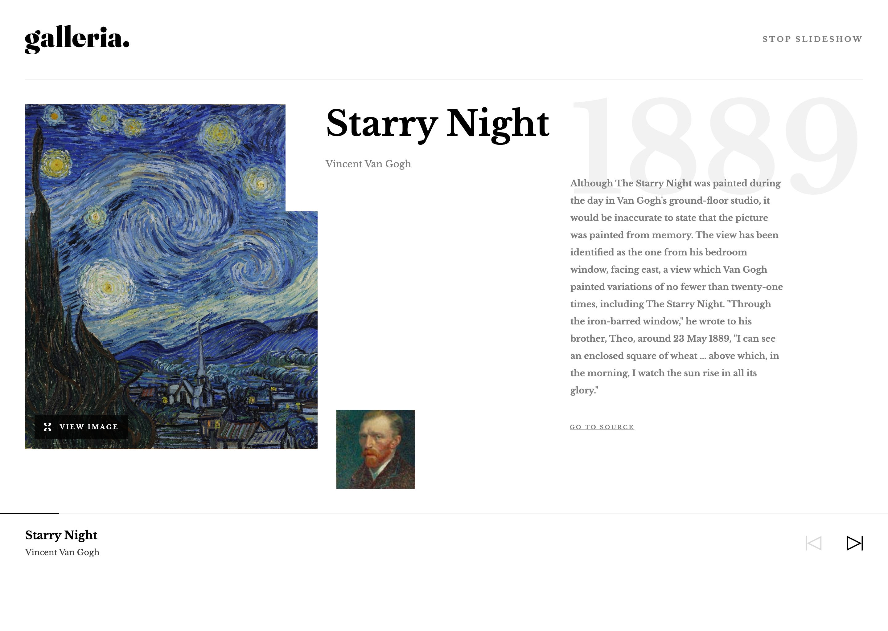

# Frontend Mentor - Galleria slideshow site solution

This is a solution to the [Galleria slideshow site challenge on Frontend Mentor](https://www.frontendmentor.io/challenges/galleria-slideshow-site-tEA4pwsa6). Frontend Mentor challenges help you improve your coding skills by building realistic projects.

## Table of contents

- [Overview](#overview)
  - [The challenge](#the-challenge)
  - [Screenshots](#screenshots)
  - [Links](#links)
- [My process](#my-process)
  - [Built with](#built-with)
  - [What I learned](#what-i-learned)
  - [Continued development](#continued-development)
  - [Useful resources](#useful-resources)
- [Author](#author)
- [Acknowledgments](#acknowledgments)

## Overview

### The challenge

Users should be able to:

- View the optimal layout for the app depending on their device's screen size
- See hover states for all interactive elements on the page
- Navigate the slideshow and view each painting in a lightbox

### Screenshots

|            Mobile designed at 375px:            |           Tablet designed at 1440px:            | Desktop designed at 1440px:                      |
| :---------------------------------------------: | :---------------------------------------------: | ------------------------------------------------ |
|    |    |    |
|  |  |  |

### Links

- Solution URL: [https://github.com/elisilk/galleria-slideshow-site](https://github.com/elisilk/galleria-slideshow-site)
- Live Site URL: [https://elisilk.github.io/galleria-slideshow-site/](https://elisilk.github.io/galleria-slideshow-site/)

## My process

### Built with

- Semantic HTML5 markup
- CSS custom properties
- Flexbox
- CSS Grid
- Mobile-first workflow
- Accessibility

### What I learned

As always, so many cool :sunglasses: things. Here are some of the key resources I used:

- Masonry layout - So much to include here.
  - [Approaches for a CSS Masonry Layout](https://css-tricks.com/piecing-together-approaches-for-a-css-masonry-layout/) - As typical for me, I look for a CSS-first approach to start and build in the JavaScript only as needed. CSS-Tricks and Chris Coyier is always a great place to start, and he didn't disappoint with this list of resources for masonry layouts.
- [Dmitry Mayorov on YouTube](https://www.youtube.com/@dmtrmrv) - I really LOVE the videos that this guy has put together. So clear, and really has addressed a number of key questions that I have struggled to fully understand. I especially like these videos:
  - [CSS Tip: Extend a Child Beyond Parent Width (the better way)](https://www.youtube.com/watch?v=MQFg2bdSY4Q&ab_channel=DmitryMayorov)
    - [GitHub Repo](https://github.com/dmtrmrv/demo-content-width)
    - [Live Demo](https://dmtrmrv.github.io/demo-content-width/)
  - [Building an Article Layout with CSS Grid—Worth It?](https://www.youtube.com/watch?v=wUJZCMhO0mA&ab_channel=DmitryMayorov)
  - [Keep Footer at the Bottom of the Page: HTML & CSS (2024)](https://www.youtube.com/watch?v=RYImAil3lgo&ab_channel=DmitryMayorov)
  - [CSS Vertical Spacing: Margins vs. Gaps Explained](https://www.youtube.com/watch?v=JZJQUP3CHgc&ab_channel=DmitryMayorov)
- [Inclusive Components - Cards](https://inclusive-components.design/cards/) - my go to for implementing an HTML cards component
- [`<progress>`: The Progress Indicator element](https://developer.mozilla.org/en-US/docs/Web/HTML/Reference/Elements/progress) - Use this for the part of the controller/footer that indicates how far along in the slideshow each detailed image is. What a great, semantic HTML element for this purpose.
  - [The HTML5 progress Element](https://css-tricks.com/html5-progress-element/)
- Using [`bind()`](https://developer.mozilla.org/en-US/docs/Web/JavaScript/Reference/Global_Objects/Function/bind) to change the [`this`](https://developer.mozilla.org/en-US/docs/Web/JavaScript/Reference/Operators/this) object used in a callback function.
  - In this case, I wanted the callback function used in the [Intersection Observer](https://developer.mozilla.org/en-US/docs/Web/API/Intersection_Observer_API) to be associated with the Slider object rather than the observer.
  - [Three ways to pass extra arguments to a function in JavaScript](https://barker.codes/blog/three-ways-to-pass-extra-arguments-to-a-function-in-javascript/)
- [`<dialog>`: The Dialog element](https://developer.mozilla.org/en-US/docs/Web/HTML/Reference/Elements/dialog)
- [Hide scroll bar, but while still being able to scroll](https://stackoverflow.com/questions/16670931/hide-scroll-bar-but-while-still-being-able-to-scroll) - Use CSS to make sure the scrollbars are entirely hidden.
- [Element: `closest()` method](https://developer.mozilla.org/en-US/docs/Web/API/Element/closest) - Find a parent HTML element that matches a certain selector. In this case, finding the slide (or `.detail` element) associated with the 'View Image` button.
- [Overlapping Grid Items](https://mastery.games/post/overlapping-grid-items/) - implement overlapping grid items using named grid areas
- [Container queries](https://developer.mozilla.org/en-US/docs/Web/CSS/CSS_containment/Container_queries)
- [Creating CSS carousels](https://developer.mozilla.org/en-US/docs/Web/CSS/CSS_overflow/CSS_carousels) - many of the elements are still experimental or don't yet have widespread browser support (e.g., [`::scroll-button()`](https://developer.mozilla.org/en-US/docs/Web/CSS/::scroll-button) and [`::scroll-marker`](https://developer.mozilla.org/en-US/docs/Web/CSS/::scroll-marker)), and so didn't implement all parts of this example entirely, but still a great model to build from
  - [CSS Carousel Gallery](https://chrome.dev/carousel/)
- [Destructuring](https://developer.mozilla.org/en-US/docs/Web/JavaScript/Reference/Operators/Destructuring)
- [Using classes](https://developer.mozilla.org/en-US/docs/Web/JavaScript/Guide/Using_classes)
- [JavaScript modules](https://developer.mozilla.org/en-US/docs/Web/JavaScript/Guide/Modules)
- [MutationObserver](https://developer.mozilla.org/en-US/docs/Web/API/MutationObserver)
  - [DOM MutationObserver – reacting to DOM changes without killing browser performance.](https://hacks.mozilla.org/2012/05/dom-mutationobserver-reacting-to-dom-changes-without-killing-browser-performance/)
- 
- 

### Continued development

Specific areas that the solution should be improved (known issues):

- [ ] The block padding end for the main slider `div` section of the detail pages should be lowered (from 40px down to 25px) in the tablet view. This is most evident looking at the slides with more content (e.g., The Great Wave off Kanagawa or Van Gogh self-portrait). Is also evident when using the 768x1280 viewport from the Figma design, and in that case there is currently a vertical scroll (which shouldn't be there). Will have to resolve that the block padding is currently set using a utility class `.block-margin-normal`, but that may need to be overridden for the details page or for the `.slider__slides` div, so that the start and end padding are differentiated in that case.
- [ ] The design seems to have a more compact ordering for the masonry layout on the homepage than would occur if just using the "min" algorithm to order the elements. Should I just hardcode the ordering for this particular design? Or figure out a fancier algorithm that seeks to balance the column heights?
- [ ] The thumbnail images seems to always be 100% of their intrinsic height, and then are possibly centered and clipped in the inline axis. But that is problematic for my masonry implementation, that pretty much assumes the items will be 100% of the column width. I think an approach I'd like to try is to have an optional parameter to the masonry implementation of the max column width. In the event that the column width exceeds that max AND there is not enough space to add a new column, the masonry flex container should not go beyond that max width and so will have extra inline space. That inline space can either be used to center the masonry container or could be put to one side or the other.
- [ ] Use a templating language and compiler to read in the data from the JSON file and generate the static HTML, instead of hard-coding each HTML element. Maybe use?
  - [Handlebars](https://handlebarsjs.com/guide/) as the templating language?
  - [Webpack](https://webpack.js.org/guides/)
  - [npm](https://docs.npmjs.com/cli/v11/configuring-npm/package-json)
  - [HTML Bundler Plugin for Webpack](https://github.com/webdiscus/html-bundler-webpack-plugin)
  - Or possibly some other [static site generator](https://github.com/myles/awesome-static-generators)? Like [Astro](https://docs.astro.build/en/getting-started/)?

More general ideas I want to consider:

Hmm 🤔 ...

### Useful resources

- [Kevin Powell on YouTube](https://www.youtube.com/@KevinPowell) - He's the best.
- [Accessibility Developer Guide](https://www.accessibility-developer-guide.com/)
- [MDN Web Docs for CSS](https://developer.mozilla.org/en-US/docs/Web/CSS) - Went here a lot to reference the different CSS properties and the shorthands, and all the great explanations about best practices.
- [The Clamp Calculator](https://royalfig.github.io/fluid-typography-calculator/) - Used for all of fluid typography and fluid spacing calculations. I didn't end up using it in this solution, but it's always there when I need it.

## Author

- Website - [Eli Silk](https://github.com/elisilk)
- Frontend Mentor - [@elisilk](https://www.frontendmentor.io/profile/elisilk)
